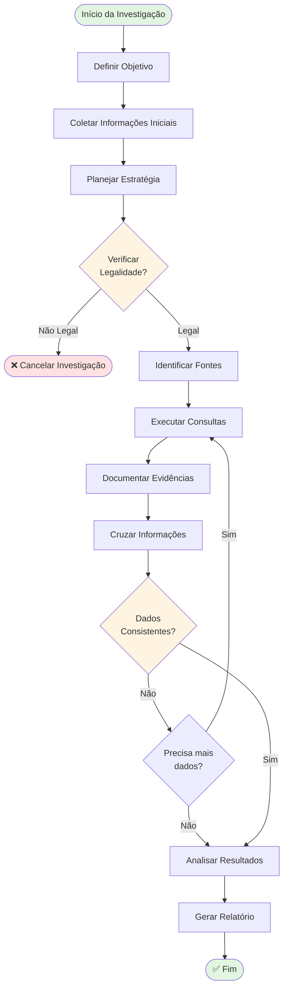
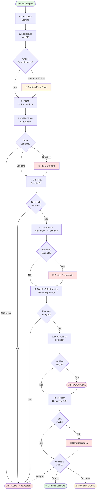
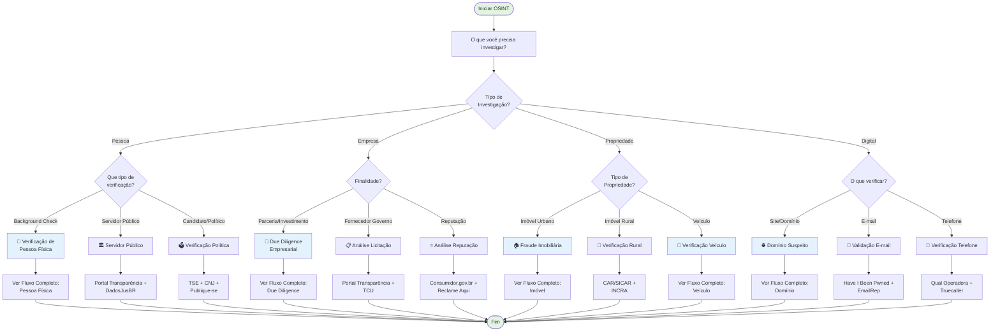

# 🛠️ Dashboard de Ferramentas OSINT & Forense

| **Categoria**     | **Recurso**           | **Funcionalidade Principal**                                                            | **Tags**                | **Link**                                                                                |
| ----------------- | --------------------- | --------------------------------------------------------------------------------------- | ----------------------- | --------------------------------------------------------------------------------------- |
| **Doutrina**      | **RFC 3227**          | Estabelece a ordem de volatilidade e coleta de evidências digitais.                     | #Forense #Doutrina      | [Link](https://academiadeforensedigital.com.br/rfc-3227-melhores-praticas-referencias/) |
| **Preservação**   | **Wayback / Archive** | Recupera versões antigas de sites e "congela" provas que podem ser apagadas.            | #Preservação #Web       | [Link](https://web.archive.org/)                                                        |
| **Inteligência**  | **OSMP NGO**          | Identificação técnica de munições e armamentos de guerra através de fotos.              | #Balística #Armas       | [Link](https://osmp.ngo/resources/)                                                     |
| **CARINT**        | **CarNet.ai**         | IA que identifica marca, modelo e ano de um veículo a partir de uma foto.               | #Veículos #Imagens      | [Link](https://carnet.ai/)                                                              |
| **Website Recon** | **Web-Check**         | Raio-X completo de um site: IP, servidor, DNS, tecnologias e segurança.                 | #Recon #Infra           | [Link](https://web-check.as93.net/)                                                     |
| **Framework**     | **OSINT Framework**   | Mapa mental interativo que categoriza milhares de ferramentas de busca.                 | #Diretório #OSINT       | [Link](https://osintframework.com/)                                                     |
| **Instagram**     | **Instaloader**       | Download massivo de posts, stories e metadados de contas públicas.                      | #SOCMINT #IG            | [Link](https://bellingcat.gitbook.io/toolkit/more/all-tools/instaloader)                |
| **Google**        | **GHunt**             | Investiga e-mails Gmail para descobrir nome real, ID, Maps e serviços ativos.           | #Google #Gmail          | [Link](https://github.com/mxrch/GHunt)                                                  |
| **YouTube**       | **YT Metadata**       | Extrai data exata de upload, tags e miniaturas ocultas de vídeos.                       | #YouTube #Metadados     | [Link](https://mattw.io/youtube-metadata/)                                              |
| **Phishing**      | **SquatSquasher**     | Identifica domínios falsos criados para aplicar golpes (typosquatting).                 | #Golpes #Phishing       | [Link](https://github.com/Stuub/SquatSquasher)                                          |
| **Dark Web**      | **OnionSearch**       | Buscador especializado para indexar e encontrar links na rede Tor (.onion).             | #DarkWeb #Tor           | [Link](https://github.com/megadose/OnionSearch)                                         |
| **Forense**       | **IPED**              | Ferramenta oficial (PF) para processar e analisar grandes volumes de dados apreendidos. | #Forense #PF            | [Link](https://github.com/sepinf-inc/IPED)                                              |
| **WhatsApp**      | **WhatsOSINT**        | Monitora status, foto de perfil e presença online de números de WhatsApp.               | #WhatsApp #Tel          | [Link](https://github.com/HackUnderway/WhatsOSINT)                                      |
| **Telefonia**     | **OsintNum**          | Validação de operadora e localização aproximada de números internacionais/nacionais.    | #Phone #Telecom         | [Link](https://github.com/HackUnderway/OsintNum)                                        |
| **Username**      | **Blackbird**         | Busca rápida por um nome de usuário em mais de 500 redes sociais simultaneamente.       | #Username #SOCMINT      | [Link](https://github.com/p1ngul1n0/blackbird)                                          |
| **E-mail**        | **Holehe**            | Verifica se um e-mail está cadastrado em sites como Twitter, Instagram e LinkedIn.      | #Email #OSINT           | [Link](https://github.com/megadose/holehe)                                              |
| **Mobile**        | **MVT Toolkit**       | Detecta vestígios de invasão e spywares (como o Pegasus) em iOS e Android.              | #Mobile #Spyware        | [Link](https://github.com/mvt-project/mvt)                                              |
| **Windows**       | **Hayabusa**          | Analisa logs do Windows em segundos para detectar invasões ou uso indevido.             | #IncidentResponse #Logs | [Link](https://github.com/Yamato-Security/hayabusa)                                     |
| **Imagens**       | **Exif Looter**       | Extrai coordenadas GPS e data/hora originais escondidas em arquivos de imagem.          | #EXIF #GPS              | [Link](https://github.com/aydinnyunus/exifLooter)                                       |
| **Monitoramento** | **Oblivion**          | Monitora em tempo real se credenciais (e-mails/senhas) foram vazadas na web.            | #DataBreach #Leaks      | [Link](https://github.com/loseys/Oblivion)                                              |

### 🛡️ Arsenal OSINT & Forense - Expansão (50 Ferramentas)

|**Categoria**|**Recurso**|**Funcionalidade Principal**|**Tags**|**Link**|
|---|---|---|---|---|
|**Facial/Imagens**|**PimEyes**|Motor de busca facial que encontra fotos de uma pessoa em toda a web.|#FaceRec #OSINT|[Link](https://pimeyes.com/)|
|**Facial/Imagens**|**FaceCheck.ID**|Busca pessoas em bancos de dados de criminosos e redes sociais por foto.|#Investigação #Face|[Link](https://facecheck.id/)|
|**Pessoas/Socmint**|**Sherlock**|A ferramenta definitiva para caçar usernames em centenas de sites.|#Username #Python|[Link](https://github.com/sherlock-project/sherlock)|
|**Pessoas/Socmint**|**Maigret**|Evolução do Sherlock: coleta dossiês sobre o alvo a partir do username.|#Dossiê #SOCMINT|[link suspeito removido]|
|**E-mail/Leaks**|**DeHashed**|Maior banco de dados de ativos vazados (e-mails, senhas, IPs).|#Breach #Leaked|[Link](https://dehashed.com/)|
|**E-mail/Leaks**|**Have I Been Pwned**|Verifica se um e-mail ou telefone foi exposto em vazamentos públicos.|#Security #Leaks|[Link](https://haveibeenpwned.com/)|
|**Cripto/Fin**|**Blockchain Explorer**|Rastreia transações de Bitcoin e visualiza o fluxo de carteiras.|#Crypto #FinINT|[Link](https://www.blockchain.com/explorer)|
|**Cripto/Fin**|**Breadcrumbs**|Ferramenta visual para investigação de crimes com criptomoedas.|#Crypto #Tracing|[Link](https://www.breadcrumbs.app/)|
|**Infra/DNS**|**Shodan**|O "Google" para dispositivos conectados (câmeras, servidores, IoT).|#IoT #Recon|[Link](https://www.shodan.io/)|
|**Infra/DNS**|**Censys**|Analisa a superfície de ataque e certificados SSL de qualquer domínio.|#Network #DNS|[Link](https://censys.io/)|
|**Infra/DNS**|**SpiderFoot**|Automação total de OSINT: integra Shodan, HaveIBeenPwned e +100 fontes.|#Automation #Recon|[Link](https://github.com/smicallef/spiderfoot)|
|**Infra/DNS**|**theHarvester**|Coleta e-mails, subdomínios, IPs e nomes de funcionários de uma empresa.|#Recon #Enterprise|[Link](https://github.com/laramies/theHarvester)|
|**Forense/Live**|**Velociraptor**|Monitoramento e resposta a incidentes (DFIR) em escala para redes.|#DFIR #Forense|[Link](https://github.com/Velocidex/velociraptor)|
|**Forense/Disk**|**Autopsy**|Interface gráfica para o Sleuth Kit; análise de discos e cartões SD.|#Forense #Autopsy|[Link](https://www.autopsy.com/)|
|**Forense/Disk**|**FTK Imager**|Padrão ouro para criação de imagens forenses preservando integridade.|#Imaging #Evidence|[Link](https://www.exterro.com/ftk-imager)|
|**Forense/Mem**|**Volatility 3**|O framework principal para análise forense de memória RAM.|#Memory #Forensics|[Link](https://github.com/volatilityfoundation/volatility3)|
|**GEOINT**|**PeakVisor**|Identifica montanhas e picos em fotos para geolocalização precisa.|#GEOINT #Terrain|[Link](https://peakvisor.com/)|
|**GEOINT**|**Wikimapia**|Mapa colaborativo que detalha áreas militares e instalações restritas.|#Maps #Intelligence|[Link](https://wikimapia.org/)|
|**GEOINT**|**SunCalc**|Calcula a posição do sol para determinar data/hora de fotos por sombras.|#Chronolocation|[Link](https://www.google.com/search?q=https://apps.suncalc.org/)|
|**SOCMINT**|**TweetDeck**|Monitoramento de termos e hashtags no X (Twitter) em tempo real.|#Twitter #RealTime|[Link](https://tweetdeck.twitter.com/)|
|**SOCMINT**|**SocialBlade**|Analisa estatísticas e crescimento de contas em YT, Twitch e Instagram.|#Analytics #Media|[Link](https://socialblade.com/)|
|**SOCMINT**|**Twint**|Scraper de Twitter que não exige API oficial (extrai fones e e-mails).|#Twitter #Scraping|[Link](https://github.com/twintproject/twint)|
|**Username**|**Namechk**|Verifica a disponibilidade/presença de uma marca/nome em centenas de sites.|#Brand #Username|[Link](https://namechk.com/)|
|**Metadados**|**ExifTool**|A ferramenta de linha de comando mais poderosa para ler/escrever metadados.|#Metadata #CLI|[Link](https://exiftool.org/)|
|**Metadados**|**Metadata2Go**|Visualizador online de metadados para diversos formatos de arquivos.|#Metadata #Web|[Link](https://www.metadata2go.com/)|
|**Mobile**|**MobSF**|Framework de análise estática e dinâmica para apps Android/iOS.|#Mobile #Malware|[Link](https://github.com/MobSF/Mobile-Security-Framework-MobSF)|
|**Mobile**|**Santoku Linux**|Distribuição focada inteiramente em forense e análise mobile.|#Linux #Mobile|[Link](https://www.google.com/search?q=https://santoku-linux.com/)|
|**Telefonia**|**TrueCaller**|Identifica nomes associados a números de telefone via crowdsourcing.|#Phone #Identidade|[Link](https://www.truecaller.com/)|
|**Telefonia**|**PhoneInfoga**|Ferramenta avançada para scan de números e detecção de operadora/local.|#Phone #Scan|[Link](https://github.com/sundowndev/phoneinfoga)|
|**Dark Web**|**Tor2Web**|Permite visualizar sites .onion através de navegadores comuns (risco alto).|#DarkWeb #Access|[Link](https://www.tor2web.org/)|
|**Dark Web**|**Ahmia**|Motor de busca que filtra conteúdo abusivo na rede Tor.|#Search #Onion|[Link](https://ahmia.fi/)|
|**Inteligência**|**Maltego**|Visualização de gráficos de relacionamento entre pessoas e infraestrutura.|#Graph #Intel|[Link](https://www.maltego.com/)|
|**Inteligência**|**Hunchly**|Extensão paga que documenta automaticamente toda a sua navegação OSINT.|#Evidence #ChainOfCustody|[Link](https://www.google.com/search?q=https://www.hunchly.com/)|
|**Empresas**|**OpenCorporates**|A maior base de dados aberta de empresas e diretores do mundo.|#FinINT #Corporate|[Link](https://opencorporates.com/)|
|**Empresas**|**Crunchbase**|Informações sobre investimentos, fundadores e conexões empresariais.|#FinINT #Business|[Link](https://www.crunchbase.com/)|
|**Nuvem**|**CloudEnum**|Busca por buckets da AWS, Azure e Google Cloud expostos.|#Cloud #Leaks|[Link](https://github.com/initstring/cloud_enum)|
|**Documentos**|**FOCA**|Extrai metadados de documentos (PDF, DOCX) para revelar nomes e software.|#Metadata #Docs|[Link](https://github.com/ElevenPaths/FOCA)|
|**Documentos**|**IntelX**|Motor de busca para dumps de dados, pastes e documentos históricos.|#Intelligence #Breach|[Link](https://intelx.io/)|
|**Rede/IP**|**Wireshark**|Analisador de tráfego de rede; essencial para forense de rede.|#Network #Packet|[Link](https://www.wireshark.org/)|
|**Rede/IP**|**IPinfo**|Dados precisos sobre ASN, localização e tipo de IP (Proxy/VPN).|#IP #Geoloc|[Link](https://ipinfo.io/)|
|**Rádio/Sinal**|**SkyGlass**|Rastreamento 3D de aeronaves em tempo real (evolução do FlightRadar24).|#ADSB #Aviation|[Link](https://www.google.com/search?q=https://www.skyglass.com/)|
|**Rádio/Sinal**|**MarineTraffic**|Monitoramento global de navios e embarcações via AIS.|#Maritime #OSINT|[Link](https://www.marinetraffic.com/)|
|**Forense Web**|**SingleFile**|Extensão para salvar uma página web completa em um único arquivo HTML.|#Evidence #Preservation|[Link](https://github.com/gildas-lormeau/SingleFile)|
|**Linux/Tool**|**Katana**|Framework de OSINT com diversos módulos integrados.|#Framework #SwissArmy|[Link](https://www.google.com/search?q=https://github.com/p1ngul1n0/Katana)|
|**Pesquisa**|**Google Dork Check**|Gerador e base de dados de Google Dorks para buscas avançadas.|#Dorks #Google|[Link](https://www.exploit-db.com/google-hacking-database)|
|**Segurança**|**VirusTotal**|Analisa arquivos e URLs para detectar malwares e infraestrutura maliciosa.|#Malware #ThreatIntel|[Link](https://www.virustotal.com/)|
|**Segurança**|**URLScan.io**|Faz um "print" e analisa o comportamento de uma URL sem visitá-la.|#Sandbox #Web|[Link](https://urlscan.io/)|
|**Nacional (BR)**|**Portal da Transparência**|Fonte primária para investigação de gastos e vínculos públicos no Brasil.|#GovBR #FinINT|[Link](https://portaldatransparencia.gov.br/)|
|**Nacional (BR)**|**Escavador**|Agregador de processos judiciais e diários oficiais brasileiros.|#Legal #Brasil|[Link](https://www.escavador.com/)|
|**IA/Imagens**|**Cleanup.pictures**|Remove objetos ou pessoas de fotos para isolar cenários em investigações.|#IA #Editing|

# 🖥️ Sistemas e Frameworks Estruturais para OSINT

| **Categoria**             | **Sistema / Framework**    | **Funcionalidade Principal**                                                                               | **Tags**                 | **Link**                                                                                |
| ------------------------- | -------------------------- | ---------------------------------------------------------------------------------------------------------- | ------------------------ | --------------------------------------------------------------------------------------- |
| **Sistemas Operacionais** | **CSI Linux**              | Sistema focado em investigações, com módulos para Dark Web, SIGINT e preservação de evidências.            | #Distro #Investigação    | [Link](https://csilinux.com/)                                                           |
| **Sistemas Operacionais** | **Tsurugi Linux**          | Distro focada em DFIR (Digital Forensics and Incident Response) e análise de evidências vivas.             | #Forense #DFIR           | [Link](https://tsurugi-linux.org/)                                                      |
| **Sistemas Operacionais** | **Trace Labs OSINT VM**    | Construída sobre o Kali Linux, é otimizada especificamente para busca de pessoas desaparecidas.            | #SOCMINT #MissingPersons | [Link](https://www.google.com/search?q=https://www.tracelabs.org/resources/osint-vm)    |
| **Sistemas Operacionais** | **Buscador OS**            | VM baseada em Debian, projetada especificamente para analistas de inteligência e OSINT.                    | #Intel #Analysis         | [Link](https://www.google.com/search?q=https://inteltechniques.com/buscador/index.html) |
| **Framework de Gestão**   | **Maltego**                | Sistema de inteligência gráfica para mapear conexões entre pessoas, redes e infraestruturas.               | #GraphIntel #Maltego     | [Link](https://www.maltego.com/)                                                        |
| **Framework de Gestão**   | **Kasware (Social Links)** | Plataforma profissional de investigação com integração de IA para reconhecimento facial e buscas em massa. | #Professional #FacialRec | [Link](https://sociallinks.io/)                                                         |
| **Automação**             | **SpiderFoot**             | Framework que automatiza a coleta de dados de mais de 100 fontes diferentes simultaneamente.               | #Automation #Recon       | [Link](https://www.spiderfoot.net/)                                                     |
| **Inteligência de Rede**  | **Shodan**                 | Sistema de varredura global que indexa todos os dispositivos conectados à internet (IoT).                  | #IoT #Infrastructure     | [Link](https://www.shodan.io/)                                                          |
| **Coleta de Provas**      | **Hunchly**                | Sistema que documenta e captura automaticamente cada passo da sua navegação para fins judiciais.           | #Custódia #Evidência     | [Link](https://www.google.com/search?q=https://www.hunchly.com/)                        |
| **Sistemas de Busca**     | **IntelTechniques**        | Coleção de ferramentas e scripts customizados pelo especialista Michael Bazzell.                           | #Doutrina #OSINT         | [Link](https://inteltechniques.com/)                                                    |
| **Busca de Dados**        | **Intelligence X**         | Motor de busca e arquivo que permite pesquisar em vazamentos de dados, e-mails e histórico da web.         | #DarkWeb #DataBreach     | [Link](https://intelx.io/)                                                              |
| **Monitoramento**         | **EchoSec / Flashpoint**   | Sistemas de nível governamental para monitoramento de ameaças em redes sociais e fóruns da Deep Web.       | #Government #Intel       | [Link](https://www.flashpoint.io/)                                                      |
| **Mapeamento/Geo**        | **Google Earth Pro**       | Essencial para análise cronológica de imagens de satélite e geolocalização tática.                         | #GEOINT #Satélite        | [Link](https://www.google.com/earth/)                                                   |
| **Análise de Arquivos**   | **ExifTool**               | O motor padrão da indústria para extração e análise de metadados em qualquer tipo de arquivo.              | #Metadata #CLI           | [Link](https://exiftool.org/)                                                           |
| **Forense Mobile**        | **Cellebrite Reader**      | Sistema (leitor) para análise de extrações de dispositivos móveis, muito usado em perícias criminais.      | #Mobile #Perícia         | [Link](https://www.cellebrite.com/)                                                     |

# 🔄 Fluxogramas de Investigação OSINT

## Índice
- [Metodologia OSINT Geral](#metodologia-geral)
- [Fluxo: Due Diligence Empresarial](#fluxo-empresa)
- [Fluxo: Verificação de Pessoa Física](#fluxo-pessoa)
- [Fluxo: Investigação de Fraude Imobiliária](#fluxo-imovel)
- [Fluxo: Verificação de Veículo](#fluxo-veiculo)
- [Fluxo: Análise de Domínio Suspeito](#fluxo-dominio)
- [Árvore de Decisão: Qual Investigação Fazer?](#arvore-decisao)

---

## 📊 Metodologia OSINT Geral {#metodologia-geral}

---

## 🏢 Fluxo: Due Diligence Empresarial {#fluxo-empresa}

```mermaid
flowchart TD
    Start([Iniciar Due Diligence]) --> Input[Coletar CNPJ/Razão Social]
    
    Input --> RF[1. Receita Federal<br/>Situação Cadastral]
    RF --> CheckRF{CNPJ<br/>Regular?}
    CheckRF -->|Não| Alert1[🚩 Red Flag:<br/>CNPJ Irregular]
    CheckRF -->|Sim| JUCESP
    
    Alert1 --> Decision1{Continuar<br/>Análise?}
    Decision1 -->|Não| Stop([❌ Reprovado])
    Decision1 -->|Sim| JUCESP
    
    JUCESP[2. JUCESP<br/>Contrato Social] --> Portal[3. Portal Transparência<br/>Contratos Públicos]
    Portal --> CheckContracts{Contratos<br/>Suspeitos?}
    CheckContracts -->|Sim| Alert2[🚩 Analisar Profundamente]
    CheckContracts -->|Não| Consumer
    
    Alert2 --> Consumer[4. Consumidor.gov.br<br/>Reclamações]
    Consumer --> CheckComplaints{Taxa de<br/>Reclamação OK?}
    CheckComplaints -->|Não| Alert3[🚩 Reputação Ruim]
    CheckComplaints -->|Sim| Judicial
    
    Alert3 --> Judicial[5. CNJ/JusBrasil<br/>Processos]
    Judicial --> CheckProcesses{Processos<br/>Graves?}
    CheckProcesses -->|Sim| Alert4[🚩 Histórico Judicial<br/>Problemático]
    CheckProcesses -->|Não| Partners
    
    Alert4 --> Partners[6. Verificar Sócios<br/>CPF + Processos]
    Partners --> CheckPartners{Sócios<br/>Limpos?}
    CheckPartners -->|Não| Alert5[🚩 Sócios com Pendências]
    CheckPartners -->|Sim| Domain
    
    Alert5 --> Domain[7. Registro.br<br/>Domínio]
    Domain --> Final{Aprovado na<br/>Análise?}
    
    Final -->|Sim| Approved([✅ Aprovado com Ressalvas])
    Final -->|Não| Stop
    
    style Start fill:#e1f5e1
    style Approved fill:#e1f5e1
    style Stop fill:#ffe1e1
    style Alert1 fill:#ffe1e1
    style Alert2 fill:#ffe1e1
    style Alert3 fill:#ffe1e1
    style Alert4 fill:#ffe1e1
    style Alert5 fill:#ffe1e1
```

---

## 👤 Fluxo: Verificação de Pessoa Física {#fluxo-pessoa}

```mermaid
flowchart TD
    Start([Iniciar Verificação]) --> Input[Coletar CPF/Nome Completo]
    
    Input --> GetName{Tem apenas<br/>CPF?}
    GetName -->|Sim| SitCad[0. situacao-cadastral.com<br/>Obter Nome Parcial]
    GetName -->|Não| CPF
    
    SitCad --> TRT[0b. TRT3 Certidão<br/>Nome Completo]
    TRT --> CPF[1. Receita Federal<br/>Situação CPF]
    
    CPF --> CheckCPF{CPF<br/>Regular?}
    CheckCPF -->|Não| Alert1[🚩 CPF Irregular/Suspenso]
    CheckCPF -->|Sim| CNJ
    
    Alert1 --> Decision{Critério<br/>Eliminatório?}
    Decision -->|Sim| Stop([❌ Reprovado])
    Decision -->|Não| CNJ
    
    CNJ[2. CNJ/Escavador<br/>Processos Judiciais] --> CheckCriminal{Processos<br/>Criminais?}
    CheckCriminal -->|Sim| Analyze1[Analisar Gravidade]
    CheckCriminal -->|Não| Transparency
    
    Analyze1 --> Serious{Processo<br/>Grave?}
    Serious -->|Sim| Stop
    Serious -->|Não| Transparency
    
    Transparency[3. Portal Transparência<br/>Vínculos Governo] --> TSE[4. TSE<br/>Doações/Candidaturas]
    TSE --> Social[5. Redes Sociais<br/>LinkedIn/Facebook]
    
    Social --> CheckSocial{Comportamento<br/>Adequado?}
    CheckSocial -->|Não| Alert2[🚩 Comportamento Inadequado]
    CheckSocial -->|Sim| Email
    
    Alert2 --> Email[6. Have I Been Pwned<br/>Vazamentos]
    Email --> CheckLeaks{Múltiplos<br/>Vazamentos?}
    CheckLeaks -->|Sim| Alert3[⚠️ Segurança Digital Fraca]
    CheckLeaks -->|Não| Academic
    
    Alert3 --> Academic[7. Lattes/E-MEC<br/>Formação]
    Academic --> CheckDegree{Diploma<br/>Válido?}
    CheckDegree -->|Não| Alert4[🚩 Formação Não Validada]
    CheckDegree -->|Sim| Final
    
    Alert4 --> Final{Resultado<br/>Final?}
    Final -->|Aprovado| Approved([✅ Aprovado])
    Final -->|Reprovado| Stop
    Final -->|Ressalvas| Conditional([⚠️ Aprovado com Ressalvas])
    
    style Start fill:#e1f5e1
    style Approved fill:#e1f5e1
    style Conditional fill:#fff4e1
    style Stop fill:#ffe1e1
    style Alert1 fill:#ffe1e1
    style Alert2 fill:#ffe1e1
    style Alert3 fill:#fff4e1
    style Alert4 fill:#ffe1e1
    style SitCad fill:#e3f2fd
    style TRT fill:#e3f2fd
```

---

## 🏠 Fluxo: Investigação de Fraude Imobiliária {#fluxo-imovel}

```mermaid
flowchart TD
    Start([Suspeita de Fraude]) --> Input[Coletar Endereço/<br/>Matrícula/Proprietário]
    
    Input --> Maps[1. Google Maps/Street View<br/>Verificar Existência Física]
    Maps --> Exists{Imóvel<br/>Existe?}
    Exists -->|Não| Fraud1([🚨 FRAUDE CONFIRMADA])
    Exists -->|Sim| CEP
    
    CEP[2. Correios<br/>Validar CEP] --> ValidCEP{CEP<br/>Válido?}
    ValidCEP -->|Não| Alert1[🚩 CEP Inválido]
    ValidCEP -->|Sim| Registry
    
    Alert1 --> Registry[3. Cartório de Imóveis<br/>Consultar Matrícula]
    Registry --> HasRegistry{Matrícula<br/>Válida?}
    HasRegistry -->|Não| Fraud1
    HasRegistry -->|Sim| Owner
    
    Owner[4. Verificar Proprietário<br/>na Matrícula] --> OwnerMatch{Proprietário<br/>Confere?}
    OwnerMatch -->|Não| Fraud1
    OwnerMatch -->|Sim| IPTU
    
    IPTU[5. Prefeitura<br/>Consultar IPTU] --> Debts{Débitos<br/>Ocultos?}
    Debts -->|Sim| Alert2[🚩 Débitos Não Declarados]
    Debts -->|Não| Liens
    
    Alert2 --> Liens[6. Verificar<br/>Ônus/Gravames] --> HasLiens{Hipotecas/<br/>Restrições?}
    HasLiens -->|Sim Não Declaradas| Fraud2[🚨 Informações Ocultas]
    HasLiens -->|Não ou Declaradas| ValidateSeller
    
    Fraud2 --> ValidateSeller[7. Validar Vendedor<br/>CPF + CNJ]
    ValidateSeller --> SellerOK{Vendedor<br/>Idôneo?}
    SellerOK -->|Não| Alert3[🚩 Vendedor com Processos]
    SellerOK -->|Sim| Broker
    
    Alert3 --> Broker[8. Verificar Corretor<br/>CRECI]
    Broker --> BrokerValid{CRECI<br/>Ativo?}
    BrokerValid -->|Não| Fraud3[🚨 Corretor Irregular]
    BrokerValid -->|Sim| Price
    
    Fraud3 --> Price[9. Comparar Preço<br/>com Mercado]
    Price --> PriceOK{Preço<br/>Razoável?}
    PriceOK -->|Muito Baixo| Alert4[🚩 Preço Suspeito]
    PriceOK -->|OK| Final
    
    Alert4 --> Final{Avaliação<br/>Final?}
    Final -->|Seguro| Safe([✅ Transação Segura])
    Final -->|Risco Alto| Fraud1
    Final -->|Risco Médio| Caution([⚠️ Prosseguir com Cautela])
    
    style Start fill:#e1f5e1
    style Safe fill:#e1f5e1
    style Caution fill:#fff4e1
    style Fraud1 fill:#ffe1e1
    style Fraud2 fill:#ffe1e1
    style Fraud3 fill:#ffe1e1
    style Alert1 fill:#ffe1e1
    style Alert2 fill:#ffe1e1
    style Alert3 fill:#ffe1e1
    style Alert4 fill:#ffe1e1
```

---

## 🚗 Fluxo: Verificação de Veículo {#fluxo-veiculo}

```mermaid
flowchart TD
    Start([Verificar Veículo]) --> Input[Coletar Placa/<br/>Chassi/RENAVAM]
    
    Input --> DETRAN[1. DETRAN<br/>Dados Básicos]
    DETRAN --> CheckStatus{Status<br/>OK?}
    CheckStatus -->|Restrição Judicial| Fraud1([🚨 NÃO COMPRAR])
    CheckStatus -->|OK| Theft
    
    Theft[2. SINESP/Consulta<br/>Roubo/Furto] --> Stolen{Registro de<br/>Roubo?}
    Stolen -->|Sim| Fraud1
    Stolen -->|Não| Auction
    
    Auction[3. Portal Leilões<br/>Histórico] --> WasAuction{Foi<br/>Leiloado?}
    WasAuction -->|Sim| Alert1[⚠️ Verificar Motivo<br/>Pode ser sinistro]
    WasAuction -->|Não| Debts
    
    Alert1 --> Debts[4. Consultar<br/>IPVA + Multas]
    Debts --> HasDebts{Débitos<br/>Altos?}
    HasDebts -->|Sim| Alert2[🚩 Negociar Abatimento]
    HasDebts -->|Não| Seller
    
    Alert2 --> Seller[5. Validar Vendedor<br/>CPF + Processos]
    Seller --> SellerOK{Vendedor<br/>Confiável?}
    SellerOK -->|Não| Alert3[🚩 Vendedor Suspeito]
    SellerOK -->|Sim| Recall
    
    Alert3 --> Recall[6. PROCON<br/>Consultar Recall]
    Recall --> HasRecall{Recall<br/>Pendente?}
    HasRecall -->|Sim| Alert4[⚠️ Exigir Regularização]
    HasRecall -->|Não| Price
    
    Alert4 --> Price[7. Tabela FIPE<br/>Valor de Mercado]
    Price --> PriceOK{Preço<br/>Compatível?}
    PriceOK -->|Muito Abaixo| Alert5[🚩 Preço Suspeito<br/>Investigar Mais]
    PriceOK -->|OK| Doc
    
    Alert5 --> Doc[8. Verificar<br/>Documentação]
    Doc --> DocOK{Documentos<br/>Legítimos?}
    DocOK -->|Não| Fraud2([🚨 Documentação Falsa])
    DocOK -->|Sim| Final
    
    Fraud2 --> Final{Decisão<br/>Final?}
    Final -->|Aprovado| Buy([✅ Pode Comprar])
    Final -->|Ressalvas| Negotiate([⚠️ Negociar Melhor])
    Final -->|Reprovado| Fraud1
    
    style Start fill:#e1f5e1
    style Buy fill:#e1f5e1
    style Negotiate fill:#fff4e1
    style Fraud1 fill:#ffe1e1
    style Fraud2 fill:#ffe1e1
    style Alert1 fill:#fff4e1
    style Alert2 fill:#ffe1e1
    style Alert3 fill:#ffe1e1
    style Alert4 fill:#fff4e1
    style Alert5 fill:#ffe1e1
```

---

## 🌐 Fluxo: Análise de Domínio Suspeito {#fluxo-dominio}

---

## 🌳 Árvore de Decisão: Qual Investigação Fazer? {#arvore-decisao}

---

## 📝 Como Usar os Fluxogramas

### 1. **Identificar o Tipo de Investigação**
Use a [Árvore de Decisão](#arvore-decisao) para determinar qual fluxo seguir.

### 2. **Seguir o Fluxo Passo a Passo**
Cada caixa representa uma ação ou consulta específica. Execute na ordem apresentada.

### 3. **Observar os Alertas**
- 🚩 **Red Flag** (vermelho): Problema grave, avaliar se continua
- ⚠️ **Alerta** (amarelo): Atenção necessária, mas não eliminatório
- ✅ **Aprovado** (verde): Tudo certo
- ❌ **Reprovado** (vermelho): Critério eliminatório

### 4. **Documentar Cada Etapa**
- Salve screenshots das consultas
- Anote data e hora
- Registre fontes utilizadas
- Mantenha cadeia de custódia

### 5. **Cruzar Informações**
Não confie em uma única fonte. Valide com múltiplas consultas.

---

---

---

  Última atualização: Dezembro 2025 
  Projeto OSINT Brazuca - Fluxogramas de Investigação 
  📊 Visualize, Planeje, Execute

